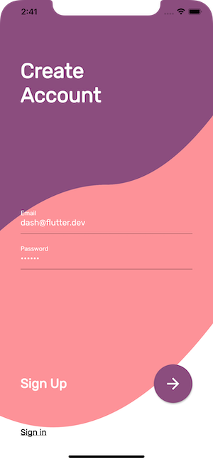
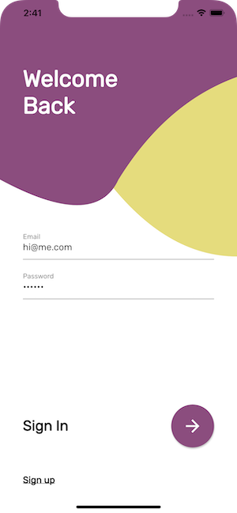
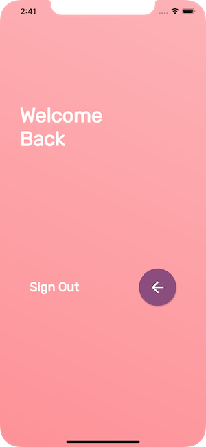
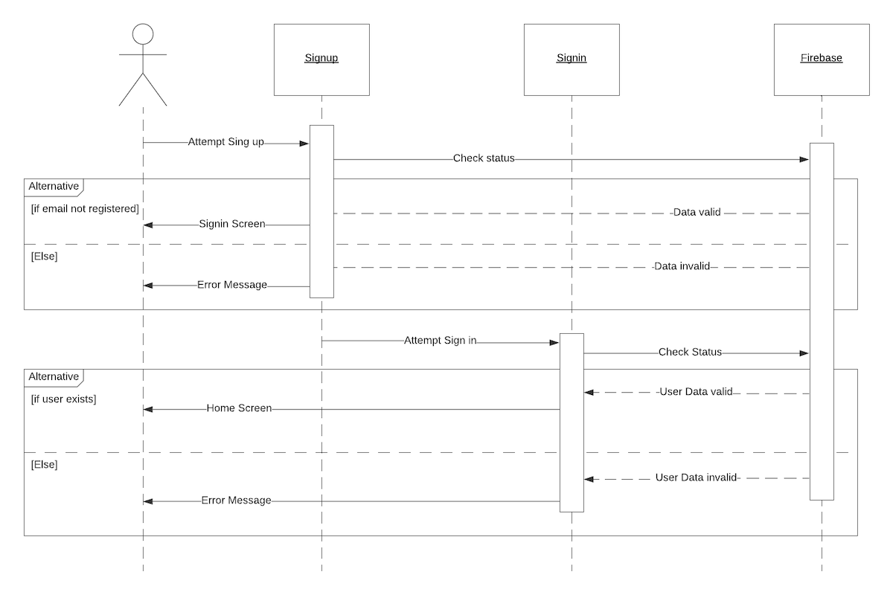

# signup

A Flutter project where the user can signup, signin and signout.

Design inspired by [Sign in / Sign up UI](https://dribbble.com/shots/6371155-Sign-in-Sign-up-UI/attachments/1364174) by [Giga Tamarashvili](https://dribbble.com/Tamarashvili).

## Screenshots

|                              |                              |                              |
| -----------------------------| ---------------------------- | ---------------------------- |
|  |  |  |

## Sequence Diagrams

## Technical Info

- The app consists of three screens: `SignupScreen`, `SigninScreen` and `HomeScreen`.
- `CustomPainter` is used to draw the background shapes in `SignupScreen` and `SigninScreen`.
- Adopts coding against interfaces (IAuthService).
- Firebase is used to authentication users - if you wish to run this app on a device, please create a firebase project and follow the setup instructions.
- `Provider` is used for dependency injection.
- `MobX` is used as the project's state management solution.
    - Use the following command to auto generate code on save: `flutter packages pub run build_runner watch --delete-conflicting-outputs`
